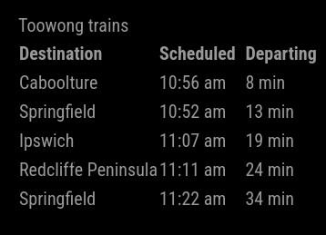
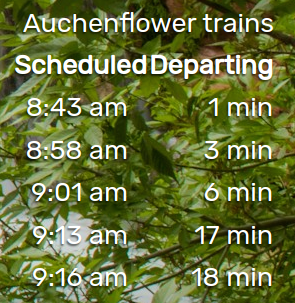

# MMM-TranslinkBrisbane

Brisbane trains info module for [MagicMirror²](https://github.com/MagicMirrorOrg/MagicMirror).

This module scrapes upcoming train info from the [Translink](https://translink.com.au) website. Data is displayed in a simple table form, showing scheduled and estimated departure times from a selected station.

## Installation

1. Install [MagicMirror²](https://docs.magicmirror.builders/)
2. Install module

  ```shell
  cd <MagicMirrorInstallation>/modules
  git clone https://github.com/dekinet/MMM-TranslinkBrisbane
  cd MMM-TranslinkBrisbane
  npm install
  ```

## Configuration

There are a number of configuration options available:

| Option               | Default          | Description  |
| ---------------------|------------------| -------------|
| `station`            | central          | The name of the station to monitor. |
| `updateIntervalSecs` | 60               | How frequently to refresh the train data. |
| `maxNumTrains`       | 5                | How many upcoming trains should be displayed. |
| `displayDestination` | false            | Include the destination of the train in the display. |
| `timeFormat`         | 24               | Show times in 12-hour or 24-hour format. |
| `directions`         | `['Downward']`   | An array of one or both of 'Upward' or 'Downward' directions. 'Downward' trains travel towards the city, 'Upward' trains travel away from the city. |

An entry in the module configuration file might look like this:

```js
  {
    module: "MMM-TranslinkBrisbane",
    position: "top_right",
    config: {
      station: "toowong",
      updateIntervalSecs: 30,
      displayDestination: true,
      timeFormat: 12,
      directions: [ 'Downward', 'Upward' ],
    }
  },
```

## Dependencies

* [MagicMirror²](https://github.com/MagicMirrorOrg/MagicMirror)
* [node-html-parser](https://www.npmjs.com/package/node-html-parser): used to parse the data from the Translink website.

## Styling

A simple `styles.css` file is included. The generated data utilises the following classes:

| Class Name           | Used                                  |
| ---------------------|---------------------------------------|
| `train-timetable`    | The whole generated div               |
| `train-table`        | The table containing train data       |
| `train-table-header` | The header row of the table           |
| `train-destination`  | Table cells in the destination column |
| `train-scheduled`    | Table cells in the scheduled column   |
| `train-departing`    | Table cells in the departing column   |
| `train-cell`         | All cells in the table                |

## Screenshots




## Developer commands

* `npm run lint` - Run linting and formatter checks.
* `npm run lint:fix` - Fix linting and formatter issues.
